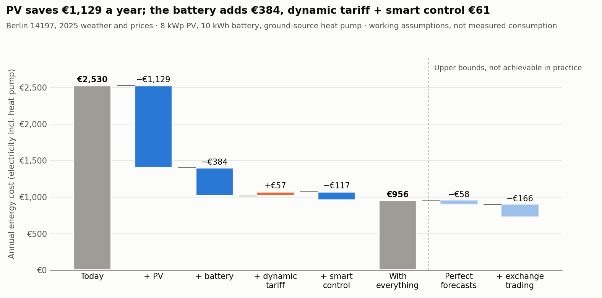

# What PV, a Home Battery and a Flexible Heat Pump Are Worth on a Dynamic Tariff

**Question:** For a house in Berlin with a ground-source heat pump, is it worth adding rooftop PV
and a home battery, and switching to a dynamic electricity tariff? How much of the value comes
from the hardware, and how much from controlling it well?

The model simulates one full year (2025, hourly) for eight setups, from today's house on a fixed
tariff to an optimised house with PV, battery and a price-aware heat pump. It then turns the
annual savings into net present value and payback.

## Main findings



- **PV is clearly worth it.** An 8 kWp east-west system saves about €1,130 a year on the fixed
  tariff and pays back in about 15 years, with a net present value of about +€3,200 over 20 years.
- **The best setup is PV plus a dynamic tariff with a price-aware heat pump, without a battery.**
  It saves about €1,290 a year, with an NPV of about +€5,500 and a payback of about 12 years. This
  holds with 10% less sun (+€4,400) and under the planned feed-in reform (+€5,500).
- **A battery does not pay at today's prices.** A 5 kWh battery adds €235 a year and breaks even
  at an installed price of about €405/kWh; a 10 kWh battery adds only €287 and breaks even at
  about €255/kWh. The model assumes €600/kWh. Most of the value comes from the first few kWh,
  which cover the evening after a sunny day.
- **Smart control alone is worth little once the battery is there** (€117 a year). Without a
  battery, a price-aware heat pump on a dynamic tariff adds about €160 a year over PV alone.
- **Charging the battery from the grid is worth about nothing.** Grid fees, taxes and levies of
  about 22 ct/kWh are paid on every kWh bought, so exchange price spreads rarely cover storage
  losses and wear.
- **After the planned feed-in reform, a battery gains value.** When exports are paid at market
  prices, the battery shifts solar exports from midday (about 7 ct/kWh) to evening peaks (about
  18 ct/kWh). A 5 kWh battery then breaks even at about €480/kWh.
- **Better forecasts would add €58 a year, full exchange trading at most €166 more.** Both are
  upper bounds. Trading assumes fees on stored and re-exported power were waived.

| Setup (8 kWp PV where present) | Annual cost | Saving vs. today | Investment | NPV (20 y) | Discounted payback |
|---|---:|---:|---:|---:|---:|
| Today: fixed tariff, no PV | €2,530 | – | – | – | – |
| PV, fixed tariff | €1,401 | €1,129 | €11,200 | +€3,239 | 15 y |
| PV + dynamic tariff + smart heat pump | €1,243 | €1,287 | €11,200 | +€5,481 | 12 y |
| … + 5 kWh battery | €1,008 | €1,522 | €14,700 | +€4,112 | 15 y |
| … + 10 kWh battery | €956 | €1,574 | €17,700 | +€628 | 20 y |
| … + 15 kWh battery | €937 | €1,593 | €20,700 | −€3,322 | never |

All results: [scenarios](reports/scenarios.csv), [every run incl. sensitivities](reports/all_runs.csv),
[investment appraisal](reports/investment.csv), [battery value](reports/battery_value.csv),
[price structure](reports/price_structure.csv).

## Why smart control adds so little here

Optimised control lowers the annual cost by €117 over simple rules on the same hardware. With
perfect forecasts it would be €175. Four things cap it for this house:

- **Most of the household price is fixed.** Of the average 34.2 ct/kWh on the dynamic tariff,
  21.8 ct (64%) are grid fees, taxes and levies that are the same in every hour. Only the
  exchange part moves, so the household price varies within a day by 17 ct/kWh on average in
  summer and only 10 ct/kWh in winter.
- **Simple rules already capture most of the value.** A battery run by the usual inverter rule
  (charge from solar surplus, discharge when the house needs power) saves €384 a year. Better
  timing adds only the €117 above.
- **The heat pump has little room to shift, and more room would not help.** It may pre-heat the
  house by up to 1.5 K and must never let it cool below 21 °C. Restricting it to on/off
  operation costs only €27 a year, and a three times larger hot-water tank adds nothing. The
  limit is not flexibility but the small price differences in winter, when it uses the most
  power. A 20% more efficient heat pump would save €172 a year in the optimised setup, and
  optimisation would add only €98 on top of simple rules.
- **Negative prices mostly coincide with the household's own solar surplus.** 89% of the 576
  negative-price hours in 2025 fall when the roof already produces more than the house uses, so
  the battery is filled with free solar power anyway. Because the fixed charges remain, the
  dynamic tariff still cost 22.3 ct/kWh on average in those hours.

Control matters more where one of these limits is lifted. After the planned feed-in reform,
exports are paid at market prices and the battery can time them: the optimised setup then costs
€87 a year less than under the fixed feed-in tariff. It would also matter more with a large
flexible load such as an electric car. And a supplier running many households can use flexibility
in markets a single home cannot reach.

## Approach

- **Data:** 2025 German day-ahead prices from [SMARD](https://www.smard.de) (15-minute prices from
  October averaged to hours) and hourly weather for Berlin 14197 from
  [Open-Meteo](https://open-meteo.com): temperature, irradiance on east- and west-facing panels,
  and the same weather as forecast the day before. See `data/`.
- **Household:** BDEW H25 standard load profile scaled to 3,500 kWh a year; 13,000 kWh of heat a
  year (space heating from degree-hours, hot water with a daily profile); a ground-source heat
  pump whose COP follows the flow temperature (seasonal COP 3.5).
- **Building:** a one-node thermal model. Every controller keeps the house at or above 21 °C; the
  optimiser may pre-heat up to 1.5 K above that. Savings never come from a colder house.
- **Controllers:**
  - Simple rules: thermostat control, and a battery that charges from PV surplus and covers load.
  - Optimiser: a linear programme re-solved every hour up to the last hour with a published
    price, committing only the next hour. It uses day-ahead weather forecasts (S5) or actual
    values (S6). Like a home energy manager, the battery then adapts to the actual hour: when
    the sun or the load differs from the forecast, it charges or discharges less rather than
    buying from or exporting to the grid beyond the plan.
- **Tariffs (2026):** fixed tariff at 35 ct/kWh. Dynamic tariff: spot price + 1.5 ct markup +
  VAT + 21.8 ct of fixed grid fees, taxes and levies. Feed-in at 7.70 ct/kWh, nothing at
  negative prices (Solarspitzengesetz). Smart meter €50 a year. Battery grid charging within
  the MiSpeL limit of 500 kWh per kWp.
- **Money:** investment €1,400/kWp PV, €600/kWh battery + €500 energy management. 20-year
  lifetime, battery replaced after 12 years at 60% of its price, 1% PV maintenance, 0.5% yearly
  PV degradation, 3% real discount rate, prices held at 2025 levels. Payback is discounted.

All inputs are in [config/household.yaml](config/household.yaml).

## Limitations

- **Consumption is assumed, not measured.** Household electricity, heat demand, roof, tariff and
  investment costs are working assumptions for a typical house. Real bills and quotes will move
  the numbers.
- **The standard load profile is smooth and serves as its own forecast.** Real households have
  sharper peaks, which lowers PV self-consumption and makes forecasts harder. The value of the
  battery and of smart control is probably overstated slightly.
- **2025 was unusually sunny** (1,011 kWh per kWp here). The 10%-less-sun sensitivity
  approximates an average year.
- **The heat pump is assumed fully controllable.** A 2010 unit may be on/off only; the on/off
  sensitivity costs €27 a year. If it runs on a separate heat-pump meter and tariff, PV and
  battery cannot supply it without merging the meters, which this model does not cover.
- **Not modelled:** §14a grid-fee reductions for controllable heat pumps, electricity price
  trends, and any intraday or balancing revenue.

## Reproduce

```bash
python3 -m pip install -e '.[dev]'
make test
make analysis      # all scenarios and sensitivities, about 20 minutes on two cores
```

`make data` refreshes the snapshot from SMARD and Open-Meteo (needs internet access).
