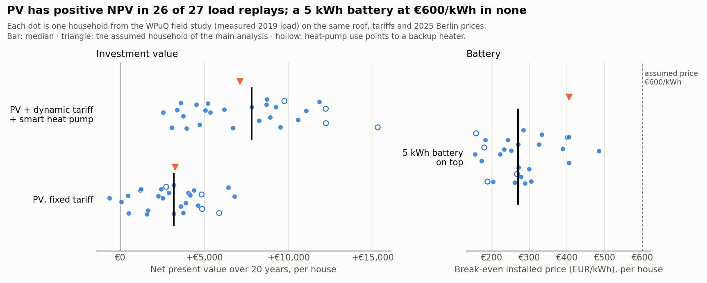

# What PV, a Home Battery and a Flexible Heat Pump Are Worth on a Dynamic Tariff

**Question:** For a house in Berlin with a ground-source heat pump, is it worth adding rooftop
PV and a home battery, and switching to a dynamic electricity tariff? How much value comes
from hardware, and how much from controlling it well?

I started with my parents' house in mind and the hope of an energy-trading side hustle.
The model compares eight setups using 2025 hourly prices and weather, values the investment,
and tests sensitivity to measured household load. The house, tariffs and installation costs
are working assumptions, rather than measured inputs from my parents' bills or supplier quotes.

Results below were regenerated after the [8 October modelling corrections](CHANGELOG.md).
The [methodology](docs/methodology.md) defines what is known at a decision, how energy is
settled, and which comparisons are operational versus hypothetical.

## Main findings


- **PV has a positive investment case under these assumptions.** The 8 kWp east-west system
  saves €1,129 a year on the fixed tariff, with an NPV of €3,239
  and a discounted payback of 15 years.
- **PV plus a dynamic tariff and a price-aware heat pump has the highest NPV among the tested
  main configurations.** Without a battery, it saves €1,400 a year,
  with an NPV of €7,102. This is a comparison within one illustrative tariff model.
- **The battery adds savings but reduces investment value at the assumed €600/kWh.** A 5 kWh
  battery adds €235/year and breaks even at about
  €405/kWh installed; 10 kWh adds
  €276/year and breaks even at
  €244/kWh. Replacement and €500 energy management are included.
- **Forecast-based control adds €96 a year over simple rules on the same hardware
  and dynamic tariff.** This isolates steering value from switching tariffs or installing PV.
  Permitting retail grid charging adds €27 compared with disabling it.
- **Knowing future weather and load changes annual cost by €54 in the same rolling
  controller.** S6 is a perfect-information benchmark, not a proven annual upper bound.
  An idealised wholesale-trading compartment changes it by another €261 (S7), under
  access and settlement assumptions that are not available to this household.
- **Measured-load replays support PV more strongly than batteries.** PV has positive NPV in
  26 of 27 cases; PV with a dynamic tariff and smart heat pump in 27.
  The 5 kWh battery's median break-even price is
  €271/kWh, with 0 cases breaking even
  at €600/kWh. These are synthetic replays, not realised investment returns.

| Setup (8 kWp PV where present) | Annual cash cost | Saving vs. today | Investment | NPV (20 y) | Discounted payback |
|---|---:|---:|---:|---:|---:|
| Today: fixed tariff, no PV | €2,530 | – | – | – | – |
| PV, fixed tariff | €1,401 | €1,129 | €11,200 | +€3,239 | 15 years |
| PV + dynamic tariff + smart heat pump | €1,130 | €1,400 | €11,200 | +€7,102 | 11 years |
| … + 5 kWh battery | €895 | €1,635 | €14,700 | +€5,730 | 12 years |
| … + 10 kWh battery | €854 | €1,676 | €17,700 | +€2,090 | 18 years |
| … + 15 kWh battery | €841 | €1,689 | €20,700 | −€1,950 | not within 20 years |

`annual_cost_eur` means cash payments net of revenues. Imputed battery wear is used to guide
dispatch and reported separately; it is not a second cash expense on top of battery replacement.
All tables: [scenarios](reports/scenarios.csv), [every main/sensitivity run](reports/all_runs.csv),
[investment](reports/investment.csv), [battery value](reports/battery_value.csv),
[price structure](reports/price_structure.csv).

## Why additional control value is limited here

The important comparison is S4 versus S5: both have the same PV, battery and dynamic tariff.
The self-consumption rule already stores midday surplus for later household use. Optimisation
must improve on that useful baseline, rather than claim all storage savings as its own.

The mean daily retail spread is 17.2 ct/kWh in May–August
and 10.0 ct/kWh in November–February. The heat pump draws
most of its energy in the colder part of the year. In 89%
of the 576 negative wholesale-price hours, the assumed roof already
produces more than the house and heat pump need. Solar overlap, limited shiftable demand,
90% round-trip battery efficiency and wear all affect the remaining opportunities.

A constant per-kWh charge **does not reduce the saving from shifting the same energy between
hours**: it cancels. It does increase the cost of storage losses and matters when imports and
exports receive different treatment. The overlap and seasonal statistics above are descriptive;
they do not separately identify the causal contribution of each mechanism.

## Do the results hold with measured household load?

The robustness check uses the 27 WPuQ houses with complete household and heat-pump meter data
in 2019. Household load is shifted by whole weeks into the 2025 calendar. Each house is then
simulated independently on the assumed roof, tariffs and Berlin weather of the main analysis.
Annual heat demand is inferred from its heat-pump meter and the model's efficiency; actual hourly
heat-pump behaviour is not replayed. The study's meters can also include auxiliary heaters.



| Per-house result | Median of 27 houses | 10th–90th percentile |
|---|---:|---:|
| PV NPV | €3,179 | €476–€5,266 |
| PV + dynamic tariff + smart heat pump NPV | €7,798 | €3,499–€11,969 |
| 5 kWh battery: additional cash saving | €169/year | €123–€233/year |
| 5 kWh battery: break-even installed price | €271/kWh | €178–€402/kWh |
| Known household load: additional saving | €33/year | €23–€58/year |

The household load forecast averages the same hour at lags of two to eight days. Its median
MAE is 48% of mean hourly load. Knowing the load in
advance adds a median €33/year on the same hardware,
while keeping weather forecasts unchanged. This isolates the load-information effect; the whole
difference from the assumed house also reflects consumption and calibrated heat demand.

The 27 homes are **not an aggregated procurement portfolio**. Forecast-error cancellation,
price-spike risk and intraday or balancing value have not been measured here. They are possible
follow-up research questions, not conclusions of this backtest.

Data and results: [WPuQ provenance](data/wpuq/README.md), [per house](reports/houses.csv),
[summary](reports/houses_summary.csv), [all household runs](reports/houses_all_runs.csv).

## Approach and assumptions

- **Data:** [SMARD](https://www.smard.de) DE-LU day-ahead prices and
  [Open-Meteo](https://open-meteo.com) Berlin weather for 2025. Quarter-hour prices are averaged
  to hourly resolution. [Snapshot provenance](data/snapshot/README.md).
- **Information:** published day-ahead prices are known; generation and heat demand use fixed
  48-hour lead weather with a conservative six-hour availability buffer. The controller checks
  availability for every planned hour. Exact forecast-run publication vintages are not archived.
- **House:** 3,500 kWh household electricity on H25, 11,000 kWh space heat and 2,000 kWh hot water;
  a ground-source heat pump, 8 kWp east-west PV and, where present, 10 kWh / 5 kW battery.
- **Control:** hourly rolling optimisation with the same physical simulator as the rule baseline.
  Both battery directions share one inverter power budget. Within-hour time-sharing is allowed;
  no sub-hour device schedule is claimed. The heat pump shares one thermal rating across space
  heating and hot water. Its 21 C target and 1.5 K pre-heating band have logged shortfalls.
- **Tariffs:** fixed import 35 ct/kWh; dynamic import is spot plus 1.5 ct/kWh supplier markup and
  15.895325 ct/kWh illustrative non-energy component, all net, then VAT once. This BDEW proxy
  is not a verified Berlin tariff. Base charges are separately configurable (zero here).
  Fixed PV feed-in is assumed at 7.70 ct/kWh, zero during negative wholesale-price hours;
  the model assumes the relevant metering/control requirements. Smart meter: €50/year.
- **Market boundary:** retail grid charging supplies the household; battery exports are disabled
  under fixed feed-in. MiSpeL settlement is not implemented. Market-based solar exports and the
  1.5 ct/kWh premium are hypothetical sensitivities. S7 additionally assumes fee-free wholesale
  trading and perfect information; it is not an achievable household business case.
- **Investment:** €1,400/kWp PV, €600/kWh battery plus €500 energy management, 20 years, 3% discount
  rate, PV maintenance, degradation and one replacement battery. Details in
  [config](config/household.yaml) and [methodology](docs/methodology.md).

## Limits and validation

- One price/weather year and assumed tariffs cannot establish a general investment return.
  The 10%-less-PV case is a sensitivity, not an independently observed average weather year.
- H25 serves as its own forecast in the main house. Measured-load replays test this assumption,
  but their annual thermal calibration uses the same scenario year, not a held-out training year.
- Hourly averages omit within-hour peaks, switching losses and detailed meter settlement.
- Comfort shortfalls are reported rather than hidden. S5 has
  14 room-temperature shortfall hours and
  0.000 kWh of unmet hot-water heat. Costs should be read
  alongside these diagnostics, especially with changed heat-pump sizes.
- Appliance-shifting cases use divisible daily energy and a simplified completion rule. Their
  results represent potential, not validated schedules for devices announced ahead of time.
- NPV scales the whole annual saving by the PV degradation factor; this is a lifetime
  approximation. Future tariff changes, §14a reductions, actual separate-meter arrangements,
  intraday execution, liquidity, balancing and portfolio risk are not modelled.
- Regression tests cover unavailable forecasts, missing-data rejection, VAT, extreme prices,
  shared inverter and SOC balances, export limits, heat-pump capacity and wear cash accounting.
  The full main/sensitivity and measured-household runs report zero solver fallbacks.

## Reproduce

```bash
python3 -m venv .venv
.venv/bin/python -m pip install -e '.[dev]'
make PYTHON=.venv/bin/python test lint
make PYTHON=.venv/bin/python analysis  # all 33 main/sensitivity runs
make PYTHON=.venv/bin/python houses    # all 27 households, 9 runs each
```

The committed tables and figures use the committed snapshot and configuration. `make data`
refreshes source data and may change the results. Keep old and refreshed results separate.
See [methodology](docs/methodology.md) and [revision notes](CHANGELOG.md) before comparing versions.
